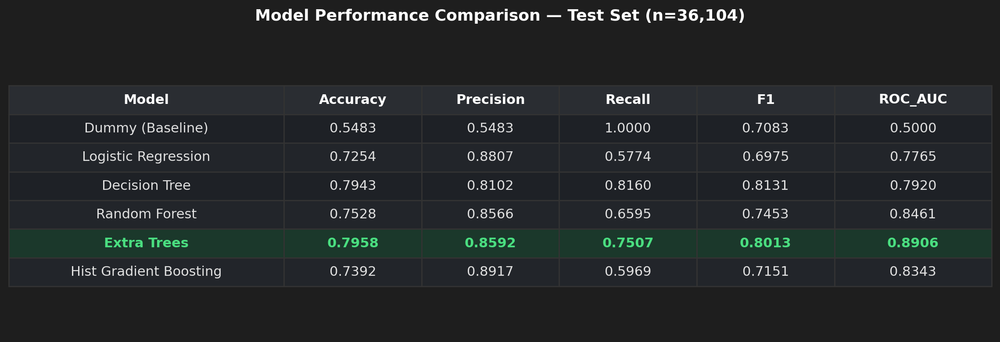
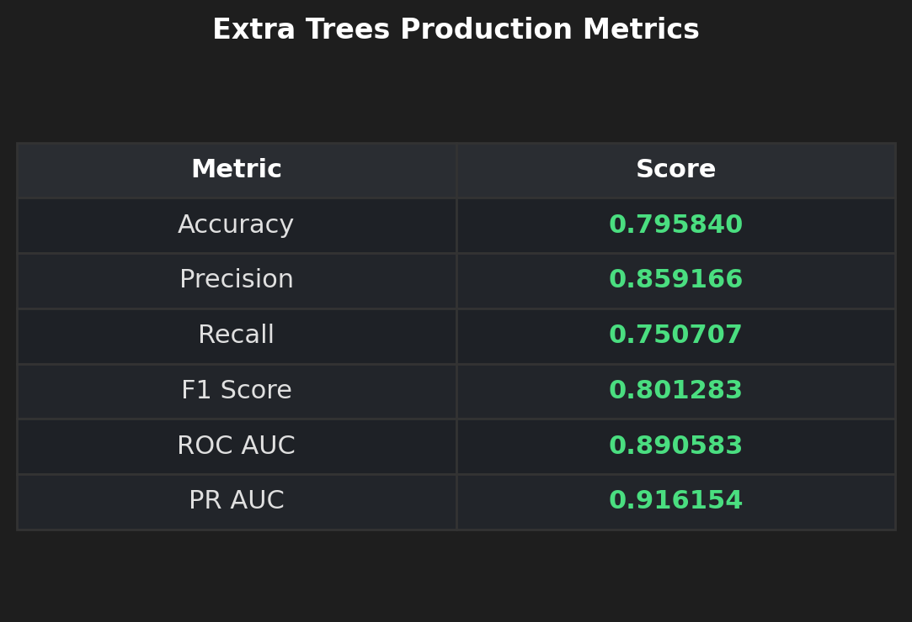
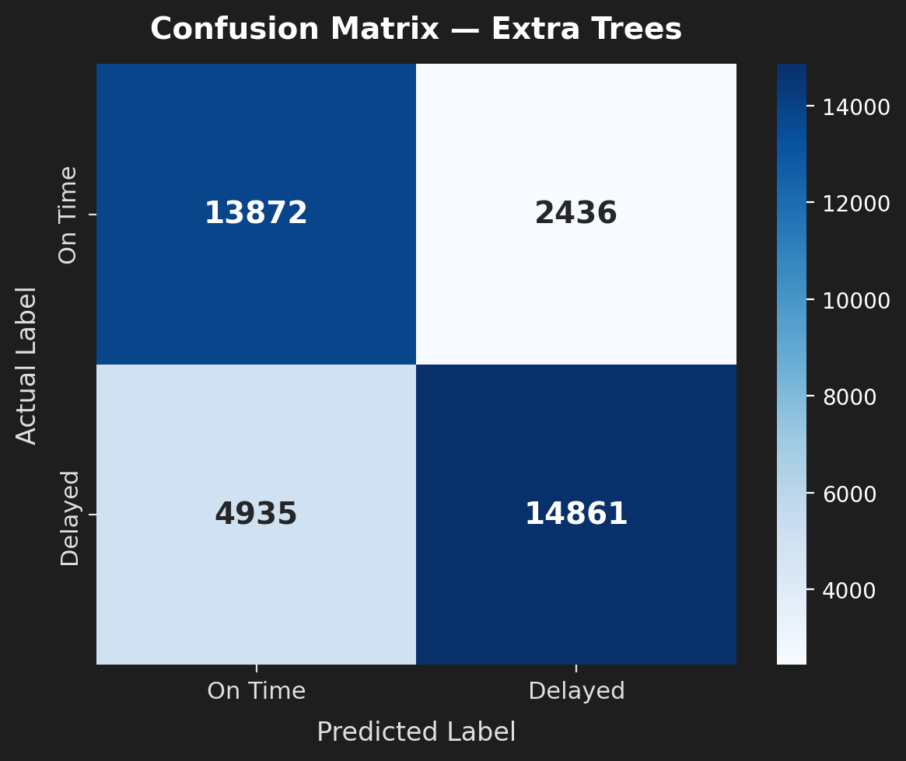
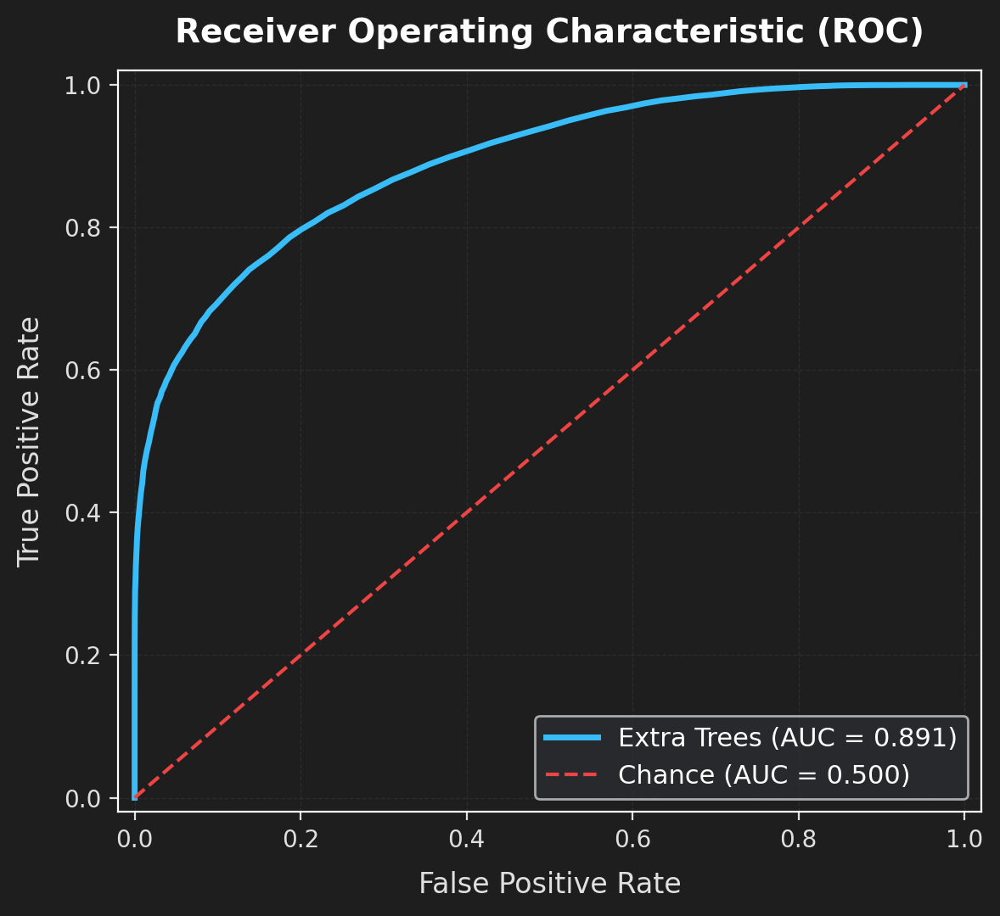

# 🚚 Supply Chain Risk Intelligence System

A machine learning project that predicts whether an order is likely to be delivered late using historical supply-chain data. The main idea was to identify high-risk shipments before dispatch, so that logistics teams have some time to decide where intervention may be useful.

---

## 📌 Overview

Delivery delays affect both customer experience and operational costs. In many cases, knowing that an order was delayed after the promised delivery window has already passed is not very useful. I wanted to see whether the information available around order placement could be used to predict late-delivery risk early enough to support action.

For this project, I used the DataCo Smart Supply Chain Dataset with 180,519 records and built an end-to-end machine learning workflow around the target variable **Late Delivery Risk** (`Late_delivery_risk` = 1) using the **DataCo Smart Supply Chain Dataset (180,519 records)**. 

The objective is not just binary classification, but reliable, calibrated probability risk scoring at **order placement**. This gives warehouse and dispatch teams the lead time needed to triage limited intervention capacity (priority picking, carrier reassignment) toward orders that need it most.

---

## 🚀 What I worked on

- 🧹 **Data cleaning and leakage check:** I removed information that would only be known after delivery, such as Days for shipping (real), Delivery Status, and actual shipping dates. This was important because keeping these variables can produce unrealistically high model performance.
- ⚙️ **Production Feature Engineering:** ECreated features related to delivery urgency, order timing, financial ratios and other leak-free aggregates. One example is an urgency flag for shipments with scheduled transit time of 2 days or less.
- 📊 **Statistical Testing & SQL :** Used Chi-Square and T-Test analysis to investigate possible delay drivers and wrote 24 SQL queries covering routing lanes, customer cohorts and other operational patterns.
- 🤖 **6 ML Models Comparision:** Compared six classification approaches — Dummy Classifier, Logistic Regression, Decision Tree, Random Forest, Extra Trees and HistGradientBoosting — using the same train/test setup.
- 🌲 **Risk scoring:** Extra Trees selected for best-in-class probability ranking (**0.891 ROC-AUC**, **0.916 PR-AUC**) and segmented into actionable Low, Medium, and High risk tiers.
- 🔍 **SHAP & Feature Explainability:** Used SHAP and feature importance analysis to understand which variables were contributing most to the predictions.
- 🎯 **Deep Error Analysis:** Uncovered that Standard Class shipping accounts for **>95% of all false negatives** due to unobserved variance in 4–6 day delivery windows.
- 📈 **Forecasting & A/B Simulation:** 7-day seasonal Holt-Winters order volume forecasting and counterfactual A/B intervention testing.
- 🖥️ **Streamlit Web Application:** Streamlit application where an order can be scored and its risk factors can be viewed in a more practical way.
---

## 📂 Project Workflow

```
DataCo Raw Dataset (180,519 records)
               │
               ▼
Data Cleaning & Leakage Purge (drop post-event columns, PII, 100% null fields)
               │
               ▼
Stratified 80/20 Split (144,415 train / 36,104 test)
               │
               ▼
Feature Engineering (urgency flags, margin ratios, temporal & aggregate features)
               │
               ▼
Statistical Validation (Chi-Square, T-Test) + 24 Analytical SQL Queries
               │
               ▼
Model Training & Comparison (6 classifiers on scikit-learn ColumnTransformer)
               │
               ▼
Evaluation & Risk Tiers (ROC-AUC, PR-AUC, calibrated dispatch probability buckets)
               │
               ▼
Error Analysis & Explainability (SHAP, slice metrics) + Streamlit Dashboard
```

---

## 📊 Models Compared & Test Results

All models were evaluated on the exact same 36,104 test holdout using a standardized `ColumnTransformer` (median imputation + `StandardScaler` for numbers; frequent imputation + `OneHotEncoder` for categories):
| Model                  |  Accuracy | Precision |    Recall |        F1 |   ROC-AUC |    PR-AUC |
| ---------------------- | --------: | --------: | --------: | --------: | --------: | --------: |
| Dummy Baseline         |     0.548 |     0.548 |     1.000 |     0.708 |     0.500 |     0.548 |
| Logistic Regression    |     0.725 |     0.881 |     0.577 |     0.698 |     0.776 |     0.842 |
| Decision Tree          |     0.794 |     0.810 | **0.816** | **0.813** |     0.792 |     0.762 |
| Random Forest          |     0.753 |     0.857 |     0.660 |     0.745 |     0.846 |     0.885 |
| **Extra Trees**        | **0.796** |     0.859 |     0.751 |     0.801 | **0.891** | **0.916** |
| Hist Gradient Boosting |     0.739 | **0.892** |     0.597 |     0.715 |     0.834 |     0.880 |

### 🏆 Why Extra Trees Was Selected
While a single Decision Tree scored a slightly higher raw F1 (0.813 vs 0.801), individual tree leaves output polarized 0/1 probabilities. In production, operations teams cannot act on every single order; they need to rank orders from riskiest to safest.

**Extra Trees** was selected as the final production model because:
1. It delivered the highest ranking discrimination: **0.891 ROC-AUC** and **0.916 PR-AUC**.
2. It outputs smooth, calibrated probabilities needed for operational risk tiering.



---

## 📈 Model Evaluation & Operational Risk Tiers

Test set performance metrics, confusion matrix, and ROC curve generated directly from our test holdout:





### Operational Risk Triage Strategy
Continuous model probabilities on the 36,104 test samples were bucketed into operational dispatch tiers:

| Risk Tier | Probability Range | Test Orders (n) | Actual Late Rate | Recommended Operational Action |
| :--- | :---: | :---: | :---: | :--- |
| **Low Risk** | p < 0.30 | 11,520 (31.9%) | **5.7%** | Standard automated fulfillment |
| **Medium Risk** | 0.30 <= p < 0.60 | 10,063 (27.9%) | **57.8%** | Watchlist; prioritize if warehouse load spikes |
| **High Risk** | p >= 0.60 | 14,521 (40.2%) | **91.8%** | Immediate priority picking & carrier upgrade |

*Threshold Tuning:* The separation between these groups was useful because the model's probability was much more informative than simply saying an order was "late" or "not late."

I also checked a lower decision threshold. Moving the threshold from 0.50 to 0.40 increased recall to **87.7%**, capturing more late deliveries while giving an F1 score of 0.816

---

## 🎯 Error Analysis: Where The Model Struggles

Breaking down model performance across shipping modes on the test set revealed a critical operational finding:

| Shipping Mode | Test Samples (n) | Precision | Recall | F1 Score | Performance Dynamic |
| :--- | :---: | :---: | :---: | :---: | :--- |
| **First Class** | 5,628 | 1.000 | 1.000 | 1.000 | Strict 1-day SLA; virtually deterministic |
| **Same Day** | 1,975 | 0.983 | 0.983 | 0.983 | Dedicated express routing; rarely misses |
| **Second Class** | 7,005 | 0.834 | 0.991 | 0.905 | High delay rate, but readily caught |
| **Standard Class** | 21,496 | 0.708 | 0.403 | **0.513** | **Responsible for >95% of all false negatives** |

**The Root Cause:** Standard Class has a wide 4 to 6 day scheduled window. Delays in this tier depend heavily on unobserved in-transit logistics noise (hub sorting congestion, carrier handoffs, traffic, weather) that cannot be known at checkout time. Across customer segments (Consumer F1: 0.794, Corporate F1: 0.806, Home Office F1: 0.814), the model showed consistent performance without demographic bias.

---

## 🔍 Feature Importance & SHAP Insights

Feature attribution from Gini importance and Tree SHAP in `notebooks/08_explainability.ipynb`:


- **The three most important predictive features were::** `num__Urgent_Shipment` (scheduled transit <= 2 days), `num__Days for shipment (scheduled)`, and `num__Order_Hour`.
- **Directional Impact:** Standard Class consistently pushes late delivery probability upward, whereas longer scheduled transit windows provide buffer time that lowers risk.
- **Order Financials:** Higher sales value and discount percentage have secondary influence, reflecting batch complexity during high-volume promotions.

---

## 🖥️ Streamlit Interactive Dashboard

An interactive dashboard is implemented in `app/app.py`:
- **Executive Summary:** Test set benchmark cards, confusion matrix breakdown, and risk tier distribution.
- **Operational Heatmaps:** Delay rates across global destination markets and shipping tiers.
- **Live Risk Predictor:** Enter order details to receive an instant calibrated probability score, Low/Medium/High risk badge, and a plain-English explanation of risk factors.

```bash
streamlit run app/app.py
```

---

## 📁 Repository Structure

```
├── app/
│   └── app.py                     # Streamlit interactive dashboard
├── data/
│   ├── raw/                       # Raw DataCo dataset (see data/README.md)
│   └── processed/                 # Cleaned splits & benchmark CSVs
├── images/                        # Generated plots from actual test evaluation
│   ├── Model_Comparison.png
│   ├── Metric_Scores.png
│   ├── Confusion_Matrix.png
│   ├── ROC_Curve.png
│   └── Feature_Importance.png
├── models/
│   └── best_model.pkl             # Trained Extra Trees production pipeline
├── notebooks/                     # 10 sequential analysis notebooks (01 to 10)
│   ├── 01_data_exploration.ipynb
│   ├── 02_data_preprocessing.ipynb
│   ├── 03_feature_engineering.ipynb
│   ├── 04_statistical_analysis.ipynb
│   ├── 05_model_training.ipynb
│   ├── 06_model_evaluation.ipynb
│   ├── 07_error_analysis.ipynb
│   ├── 08_explainability.ipynb
│   ├── 09_forecasting.ipynb
│   └── 10_ab_test_simulation.ipynb
├── sql/                           # 24 analytical SQL queries across 3 domains
├── src/                           # Modular Python package
│   ├── data_loader.py
│   ├── preprocessing.py
│   ├── features.py
│   └── model.py
├── requirements.txt               # Project dependencies
└── README.md
```

---

## 🛠️ Tech Stack

- **Core & Data Processing:** Python, Pandas, NumPy, SQLite
- **Machine Learning:** Scikit-learn (Pipelines, ExtraTrees, HistGradientBoosting)
- **Explainability & Plotting:** SHAP, Matplotlib, Seaborn
- **Statistics & Time Series:** SciPy (Chi-Square, T-Test), Statsmodels (Holt-Winters)
- **Web Application:** Streamlit

---

## ⚙️ How to Run

```bash
# 1. Clone repository and install dependencies
git clone https://github.com/YogeshKhillare04/supply-chain-risk-intelligence.git
cd supply-chain-risk-intelligence
pip install -r requirements.txt

# 2. Download DataCo dataset into data/raw/DataCoSupplyChainDataset.csv (see data/README.md)

# 3. Launch the Streamlit dashboard
streamlit run app/app.py

# 4. Explore notebooks in numerical order (01 to 10)
jupyter notebook notebooks/
```

---

## ⚠️ Limitations & Future Work

- **Observational Historical Data:** The dataset lacks live GPS telemetry, transit weather, and carrier handoff timestamps.
- **Standard Class Ceiling:** As error analysis showed, order-time tabular features hit an information ceiling without in-transit visibility.
- **Simulated Experimentation:** The A/B test is a counterfactual statistical simulation rather than an active field deployment.

---

