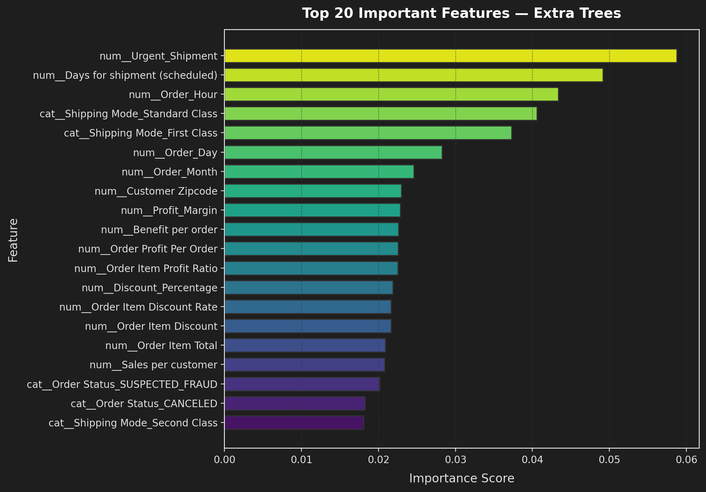

# Supply Chain Risk Intelligence

Predicting late delivery risk at the exact moment an order is placed, giving logistics teams lead time to intervene before shipments leave the warehouse.

---

## Why I Built This
In e-commerce and delivery operations, learning that a shipment was delayed after the delivery window has passed is too late to fix. Once a package is on a truck, you cannot easily reroute or prioritize it.

The goal of this project was to build an operational risk scoring pipeline that flags high-risk orders at checkout (`Late_delivery_risk` = 1) using only data known at order placement. Rather than outputting just a binary flag, the model generates calibrated risk probabilities so warehouse teams can triage limited intervention capacity (like priority picking or carrier upgrades) toward the orders that actually need it.

## The Dataset & The Data Leakage Problem
I worked with the [DataCo Smart Supply Chain Dataset](https://www.kaggle.com/datasets/shashwatwork/dataco-smart-supply-chain-for-big-data-analysis) (180,519 records from 2015 to 2018).
- **Target Distribution:** 98,977 delayed orders (54.8%) vs. 81,542 on-time orders (45.2%).
- **Cleaning & PII:** Dropped customer PII (names, emails, passwords, street addresses) and redundant IDs. Removed `Product Description` (100% null) and `Order Zipcode` (86.2% null).

### Catching Data Leakage
The biggest pitfall in this dataset is post-event target leakage. Features like `Days for shipping (real)` and `Delivery Status` are recorded after delivery. Leaving them in produces a fake 99% accuracy model. I wrote a dedicated cleaning step in `src/preprocessing.py` to strip them before any modeling:

```python
leakage_cols = [
    "Days for shipping (real)",    # Actual transit time (only known after delivery)
    "Delivery Status",             # Delivery outcome (target in disguise)
    "shipping date (DateOrders)"   # Actual ship date (recorded post-dispatch)
]
df = df.drop(columns=leakage_cols)
```

To avoid 5,000+ sparse one-hot columns from raw cities and states, I dropped high-cardinality location fields and kept broader regional signals (`Market`, `Order Region`, `Order Country`).

## Feature Engineering & Pipeline Design
I split the 180,519 rows into an 80% train set (144,415) and 20% test set (36,104) with stratification **before** feature computation to prevent lookahead bias:
1. **Domain Signals:** In `src/features.py`, I created transit urgency flags (`Urgent_Shipment` for scheduled transit <= 2 days), financial ratios (`Profit_Margin`, `Discount_Percentage`, `Sales_Per_Item`), and checkout timing (`Order_Hour`, `Is_Weekend`).
2. **Out-of-Fold Aggregates:** Computed category and shipping volume statistics on the training set only and mapped them onto the test set.
3. **Preprocessing:** Packaged transformations inside a scikit-learn `ColumnTransformer` (median imputation + `StandardScaler` for numbers; frequent imputation + `OneHotEncoder` for categories).

## Statistical Hypothesis Testing & SQL
Before modeling, I validated relationships in `notebooks/04_statistical_analysis.ipynb`:
- **Chi-Square Test:** Evaluated `Shipping Mode` vs `Late_delivery_risk`. The result was Chi-Square = 37,716.04 (p < 0.001, df = 3), statistically confirming that shipping mode is strongly tied to delay risk.
- **Two-Sample T-Test:** Confirmed scheduled transit days between delayed and on-time shipments differ significantly (p < 0.001).
- **SQL Analysis:** Wrote 24 queries across `sql/business_analysis.sql`, `sql/delivery_analysis.sql`, and `sql/risk_analysis.sql` using CTEs, window functions (`RANK()`, `LAG()`), and cohort aggregations to isolate high-risk lanes and customer lifetime revenue.

## Model Benchmarking
I trained 5 algorithms against a Dummy baseline on the exact same 36,104 test holdout (`data/processed/model_comparison.csv`):

| Model | Accuracy | Precision | Recall | F1 Score | ROC-AUC | PR-AUC |
| :--- | :---: | :---: | :---: | :---: | :---: | :---: |
| Dummy Baseline | 0.548 | 0.548 | 1.000 | 0.708 | 0.500 | 0.548 |
| Logistic Regression | 0.725 | 0.881 | 0.577 | 0.698 | 0.776 | 0.842 |
| Decision Tree | 0.794 | 0.810 | **0.816** | **0.813** | 0.792 | 0.762 |
| Random Forest | 0.753 | 0.857 | 0.660 | 0.745 | 0.846 | 0.885 |
| **Extra Trees (Selected)** | **0.796** | 0.859 | 0.751 | 0.801 | **0.891** | **0.916** |
| Hist Gradient Boosting | 0.739 | **0.892** | 0.597 | 0.715 | 0.834 | 0.880 |

### Why Extra Trees Won Over Decision Tree
While a single Decision Tree scored a slightly higher binary F1 (0.813 vs 0.801), individual tree leaves output uncalibrated probabilities (mostly 0 or 1). In production, logistics teams need to rank orders by risk level rather than treat all flags identically. Extra Trees delivered the highest ranking performance with **0.891 ROC-AUC** and **0.916 PR-AUC**.

Test set confusion matrix on the 36,104 holdout:
- **True Negatives:** 13,872 | **False Positives:** 2,436
- **False Negatives:** 4,935 | **True Positives:** 14,861

### Operational Risk Tiers
In `notebooks/06_model_evaluation.ipynb`, I converted the continuous probabilities into practical dispatch tiers:

| Risk Tier | Probability Range | Orders (n) | Actual Late Rate | Actionable Dispatch Strategy |
| :--- | :---: | :---: | :---: | :--- |
| **Low Risk** | p < 0.30 | 11,520 (31.9%) | **5.7%** | Standard automated processing |
| **Medium Risk** | 0.30 <= p < 0.60 | 10,063 (27.9%) | **57.8%** | Watchlist; flag if batch volume spikes |
| **High Risk** | p >= 0.60 | 14,521 (40.2%) | **91.8%** | Priority fulfillment & carrier reassignment |

Lowering the decision threshold from 0.50 to 0.40 boosts recall to **87.7%** (catching over 2,400 additional delays) with an F1 of 0.816.

## Feature Importance & SHAP
Tree SHAP and Gini feature importances confirmed what drives late deliveries:



- `Shipping Mode (Standard Class)` and `Urgent_Shipment` are the top two predictors.
- SHAP values in `notebooks/08_explainability.ipynb` show that Standard Class pushes delay risk up, while longer scheduled buffer days push risk down.

## Error Analysis: Why Standard Class Fails
In `notebooks/07_error_analysis.ipynb`, I broke down test set errors by shipping mode to see where mistakes happened:

| Shipping Mode | Test Samples (n) | Precision | Recall | F1 Score | Finding |
| :--- | :---: | :---: | :---: | :---: | :--- |
| **First Class** | 5,628 | 1.000 | 1.000 | 1.000 | 1-day SLA; almost perfectly deterministic |
| **Same Day** | 1,975 | 0.983 | 0.983 | 0.983 | Express routing; rarely misses |
| **Second Class** | 7,005 | 0.834 | 0.991 | 0.905 | High delay rate, but easily identified |
| **Standard Class** | 21,496 | 0.708 | 0.403 | **0.513** | **Accounts for >95% of all false negatives** |

Standard Class has a wide 4 to 6 day delivery window. Delays here stem from transit noise (traffic, weather, sorting hub backlogs) that cannot be captured from checkout data alone. Across customer segments (Consumer F1: 0.794, Corporate F1: 0.806, Home Office F1: 0.814), the model showed balanced fairness without demographic bias.

## Forecasting & A/B Simulation
- **Volume Forecasting (`notebooks/09_forecasting.ipynb`):** Aggregated 1,127 daily order counts (averaging ~160 orders/day) and fitted a 7-day seasonal Holt-Winters Exponential Smoothing model to help dispatchers forecast staffing spikes.
- **A/B Test Simulation (`notebooks/10_ab_test_simulation.ipynb`):** Built a counterfactual simulation modeling a 30% delay-reduction intervention on high-risk orders. A two-sample z-test confirmed statistically significant delay rate reduction (p < 0.001).

## Streamlit Dashboard
I built an interactive web app in `app/app.py`:
1. **Overview:** Test set metrics, confusion matrix breakdown, and risk tier distribution cards.
2. **Operational Insights:** Delay heatmaps across shipping methods and regional destination markets.
3. **Live Predictor:** An interactive form that lets an operator input order details and returns the calibrated delay probability, a color-coded risk badge (Low/Medium/High), and an explanation of the main risk factors.

## Limitations
- **Observational Data:** Lacks real-time GPS telemetry, carrier transit logs, and live weather.
- **Standard Class Ceiling:** As error analysis showed, order-time tabular features hit an information limit for standard shipping delays.
- **Simulated Experimentation:** The A/B test is a counterfactual simulation, not a live production deployment.

## Tech Stack
- **Languages & Core:** Python, Pandas, NumPy, SQLite
- **Machine Learning:** Scikit-learn (Pipelines, ExtraTrees, HistGradientBoosting)
- **Stats & Forecasting:** SciPy (Chi-Square, T-Test), Statsmodels (Holt-Winters)
- **Explainability & Viz:** SHAP, Matplotlib, Seaborn
- **Web App:** Streamlit

## How to Run
```bash
# 1. Clone repo and install requirements
git clone https://github.com/YogeshKhillare04/supply-chain-risk-intelligence.git
cd supply-chain-risk-intelligence
pip install -r requirements.txt

# 2. Add raw dataset to data/raw/DataCoSupplyChainDataset.csv (see data/README.md)

# 3. Launch Streamlit app
streamlit run app/app.py

# 4. Run notebooks in sequence (01 to 10)
jupyter notebook notebooks/
```
